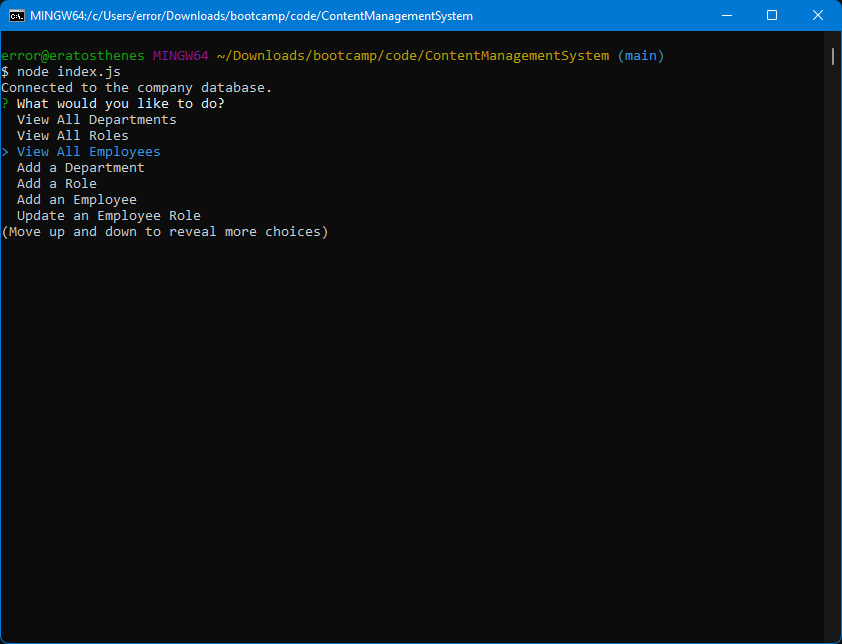

# NoteTaker

## Description

This project utilizes Node.js, Inquirer, mysql2.js, and a MySQL database to retrieve from and edit database tables based on user input.

## Table of Contents (Optional)

- [Installation](#installation)
- [Usage](#usage)
- [Credits](#credits)
- [License](#license)

## Installation
This project requires a working MySQL server.

At the command prompt, type:
```
git clone git@github.com:error201/ContentManagementSystem.git
``` 
to clone the repository. Navigate into the new folder and type:
```
npm install
```
to install the necessary npm packages.
Enter your MySQL shell and run the `schema.sql` file by typing:
```
SOURCE schema.js
```
This will set up the MySQL tables for the project.


## Usage

To run the project, from the command prompt type:
```
node index.js
```
Follow the onscreen prompts to make changes to the database tables.


 


## Credits

Several packages and/or libraries were used for this project:
 - [Node.js](https://nodejs.org/en/)
 - [mysql2](https://www.npmjs.com/package/mysql2)
 - [Inquirer](https://www.npmjs.com/package/inquirer)

## License

This project is covered by the MIT license. Please see [LICENSE](./LICENSE) for details.


---

## Badges


## How to Contribute

Feel free to fork and/or clone this repository to contribute.
